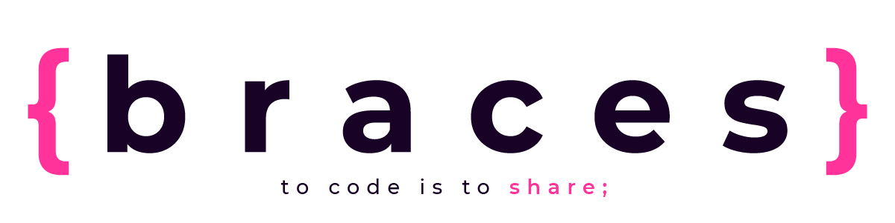

</a>

## { B R A C E S . a p p }

<strong>Braces</strong> is an app created by developers for developers.

Since there's been a lack of updated information regarding programming languages and new technologies, specially in Spanish, our goal is to build a community capable to support both, aspiring and advanced developers. 

You can find a large library full of updated information about several languages and tools. Also, you can share your concerns and questions regarding your new project and ask the community for an opinion, or ask for help.

Stay updated with our news section! See what's going on into the geek world and never miss an update of your favorite framework again.
